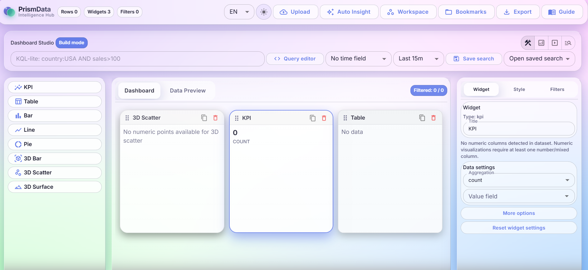

# Smart Data Dashboard Builder

Конструктор аналитических дашбордов для CSV/JSON данных с режимами сборки и исследования, 2D/3D виджетами, фильтрами и локальным сохранением состояния.

## Что умеет приложение

- Импорт данных из `CSV` и `JSON`.
- Режимы работы: `Build`, `Analyze`, `Present`, `Discover` (роуты `/dashboard` и `/discover`).
- Виджеты:
  - 2D: `KPI`, `Table`, `Bar`, `Line`, `Pie`;
  - 3D (Three.js): `3D Bar`, `3D Scatter`, `3D Surface`.
- Глобальные фильтры и cross-filter взаимодействия.
- Discover-функциональность:
  - KQL-lite запросы;
  - временной фильтр;
  - таблица с сортировкой/пагинацией;
  - статистика полей;
  - сохраненные поиски.
- Индивидуальные стили на уровне каждого виджета (включая палитру графиков).
- Локализация интерфейса (`EN` / `RU`).
- Экспорт:
  - CSV (отфильтрованные данные),
  - JSON (конфигурация),
  - PNG / PDF.

## Технологический стек

- `React 19` + `TypeScript`
- `Vite 7`
- `Material UI` + `Sass`
- `Zustand` (состояние и persist)
- `Three.js` (3D визуализации)
- `react-router-dom` (маршрутизация)
- `@monaco-editor/react` (редактор запросов)
- `Vitest` + `Testing Library`
- `ESLint` + `Stylelint` + `Prettier`

## Запуск проекта

Установить зависимости:

```bash
npm ci
```

Запустить dev-сервер:

```bash
npm run dev
```

Собрать production-бандл:

```bash
npm run build
```

## Quality Gates

- `npm run format:check` - проверка форматирования Prettier
- `npm run lint` - проверка ESLint
- `npm run lint:styles` - проверка Stylelint для SCSS
- `npm run typecheck` - проверка типов TypeScript
- `npm run test` - юнит-тесты
- `npm run test:coverage` - юнит-тесты с покрытием
- `npm run build` - production-сборка
- `npm run check` - полный локальный quality gate

## Поддерживаемые форматы данных

- `CSV` с заголовком и минимум одной строкой данных
- `JSON` в виде массива объектов

## Структура проекта

- `src/app` - провайдеры приложения, тема, глобальные стили
- `src/entities` - доменные типы и модели
- `src/features` - бизнес-фичи (импорт, фильтры, discover, export, persistence)
- `src/shared` - переиспользуемые UI-компоненты и утилиты
- `src/store` - Zustand-сторы
- `src/widgets` - реализации виджетов и рендеринг

## Сохранение данных

Состояние дашборда сохраняется в `localStorage` под версионированным ключом и включает:

- виджеты и лэйауты,
- фильтры,
- состояние Discover.

При загрузке выполняется проверка структуры данных; поврежденные/невалидные payload безопасно отклоняются.

## Решение проблем

- **Ошибки сборки/типов после обновления зависимостей**: выполните `npm ci` для синхронизации `lockfile`.
- **Не видно данных в предпросмотре**: проверьте расширение файла (`.csv` / `.json`) и наличие строк данных.
- **Сохраненный дашборд не загружается**: выполните сброс состояния через UI и сохраните заново с актуальной схемой.

## Документация для пользователя

- Подробное руководство: `docs/user-guide.md`

## Скриншот стартовой страницы


